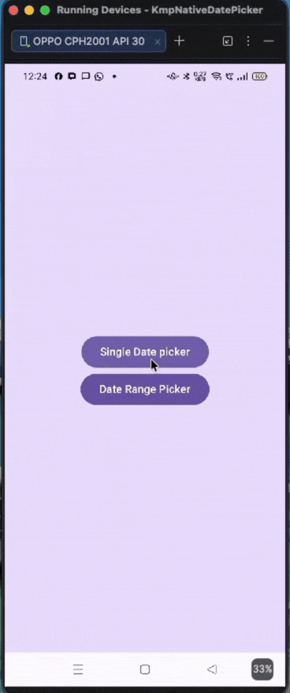
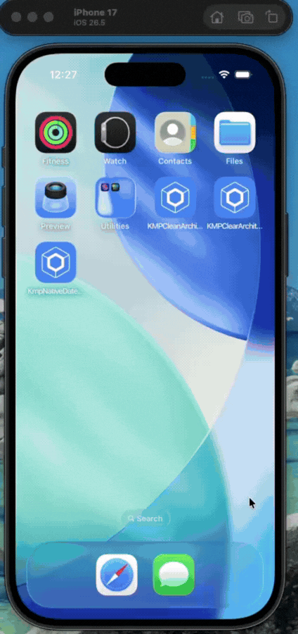

# 📅 KmpNativeDatePicker

[](https://central.sonatype.com/artifact/io.github.ktsnippetbyshubham/kmp-native-datepicker)
[](https://kotlinlang.org)
[](#)
[](https://opensource.org/licenses/Apache-2.0)

A Kotlin Multiplatform library that provides a **truly native** Date Picker experience for both Android and iOS. This library uses platform-specific components that automatically inherit your application's theme and branding.

---

## ✨ Features

*   🎯 **100% Native UI**: Uses Google's `MaterialDatePicker` on Android and Apple's `UIDatePicker` on iOS.
*   🎨 **Zero-Config Theming**: Automatically adopts the host app's colors (e.g., if your app is Orange, the picker turns Orange).
*   🚀 **Coroutines Powered**: Simple `suspend` functions that return selected timestamps (Long) or date ranges.
*   🏗 **Compose Multiplatform Ready**: Includes a `rememberDatePicker()` helper for seamless integration.
*   📅 **Range Support**: Built-in support for selecting date ranges with a native popup experience.

---

## 📺 Demo

| Android | iOS |
| :---: | :---: |
|  |  |

---

## 📸 Screenshots

| Android (Single) | Android (Range) | iOS (Single) | iOS (Range) |
| :---: | :---: | :---: | :---: |
|  |  |  |  |

---

## 📦 Installation

Add the dependency to your `commonMain` source set in your `build.gradle.kts`:

```kotlin
kotlin {
    sourceSets {
        commonMain.dependencies {
            implementation("io.github.ktsnippetbyshubham:kmp-native-datepicker:1.0.0")
        }
    }
}
```

---

## 🚀 Usage

### 1️⃣ In Compose Multiplatform (Recommended)

Use the `rememberDatePicker()` helper to get an instance of the picker in your UI.

#### 📅 Single Date Picker
```kotlin
val datePicker = rememberDatePicker()
val scope = rememberCoroutineScope()

Button(onClick = {
    scope.launch {
        val selectedMillis = datePicker.pickDate(
            title = "Select Birthday",
            doneButtonText = "Save",
            cancelButtonText = "Close"
        )
        // returns Long? (null if cancelled)
    }
}) {
    Text("Open Picker")
}
```

#### 🗓 Date Range Picker
```kotlin
Button(onClick = {
    scope.launch {
        val range = datePicker.pickDateRange(
            title = "Select Vacation Dates"
        )
        // returns DateRange? { startDateMillis, endDateMillis }
    }
}) {
    Text("Open Range Picker")
}
```

### 2️⃣ Manual Initialization

If you are not using Compose:

- **Android**: `val datePicker = DatePickerFactory(context).createDatePicker()`
- **iOS**: `val datePicker = DatePickerFactory().createDatePicker()`

---

## 🎨 Theming & Customization

The library is designed to be **"Brand-Aware"**. You don't need to pass color codes manually.

### 🤖 Android
The picker follows your `MaterialTheme`. To change the color, simply update your `colorPrimary` in your app's theme:
```xml
<item name="colorPrimary">#FF5722</item> <!-- Your brand color -->
```

### 🍎 iOS
The picker automatically uses the **System Global Tint**. If you have set a custom tint color for your app's window, the picker buttons and selection highlights will match it automatically.

---

## 📖 API Reference

### `pickDate`
| Parameter | Type | Description |
| :--- | :--- | :--- |
| `initialDateMillis` | `Long?` | Initial date to show (Default: Now) |
| `minDateMillis` | `Long?` | Minimum selectable date |
| `maxDateMillis` | `Long?` | Maximum selectable date |
| `title` | `String?` | Custom title for the dialog |
| `doneButtonText` | `String?` | Label for the positive button |
| `cancelButtonText` | `String?` | Label for the negative button |

### `pickDateRange`
Similar parameters to `pickDate`, but returns a `DateRange` object containing `startDateMillis` and `endDateMillis`.

---

## 🛠 Platform Details

- **Android**: Uses `MaterialDatePicker`. The range picker is specifically configured to show as a centered popup/dialog rather than full-screen for a better user experience.
- **iOS**: Uses `UIDatePicker` inside a `UIAlertController`. Single dates use the classic Wheel style, while Range selection uses a smart sequential selection with the Inline Calendar style.

---

## 📄 License
Apache License 2.0. See [LICENSE](LICENSE) for details.
